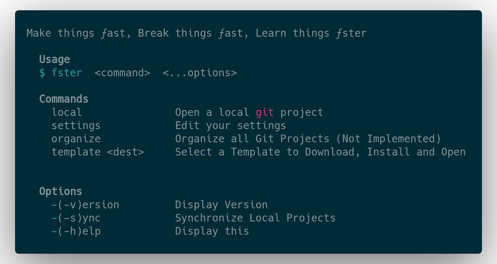

<h1 align="center">ƒster</h1>

[](https://en.wikipedia.org/wiki/Here_be_dragons)


<p align="center">
  
</p>


## Installing

#### **`npm`**

```shell
npm i -g fster
```

#### **`yarn`**

```shell
yarn global add fster
```
